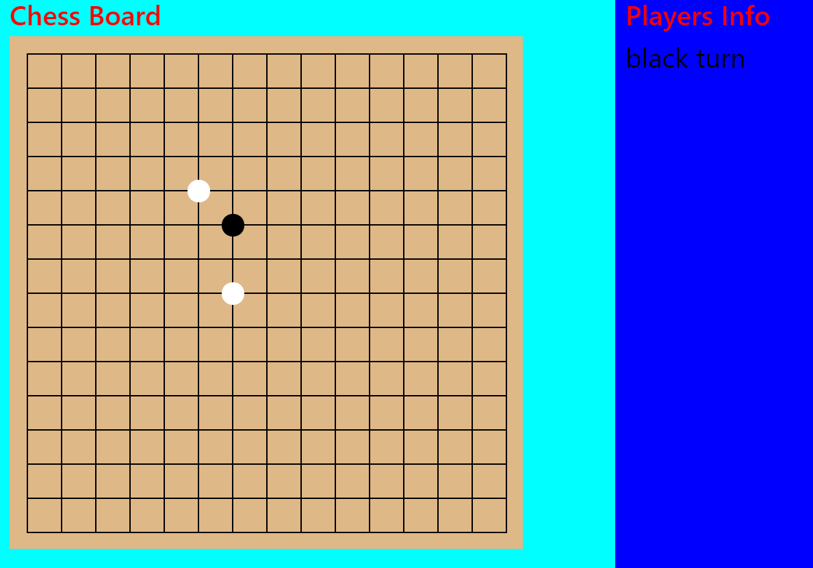
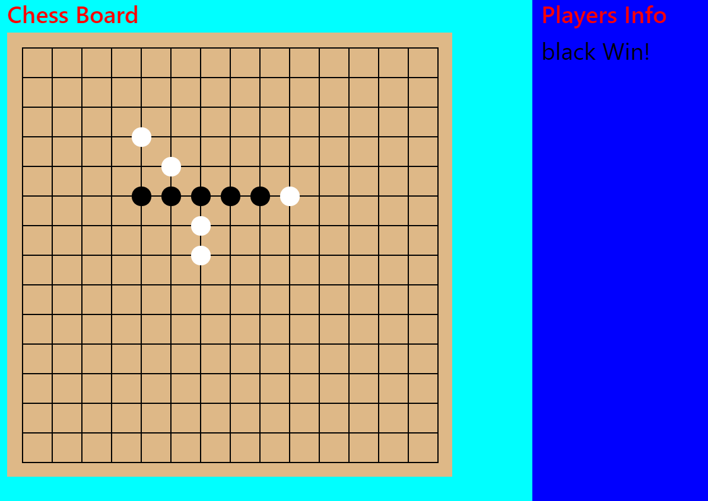

# 5 in a row

**A CASUAL GAME YOU CAN PLAY WITH YOU FIREND IN FREE TIME!!**

## Game Introduction
This game has PVP and PVE mode. 

That mean you can play with you friend or play with computer

**__PVE mode will implement later__**

## Installation
1. clone the project

2. run "npm install" to install node module

3. run "npm start" to play the game!!

## How to play
white stone will go first, then black stone

click anywhere you want to move on the chessboard

if any player connect a row in 5 of their stone, then win!

## screenshot

### Libraries and frameworks used
* electron
* jQuery
* bootstrap
* SASS & SCSS
